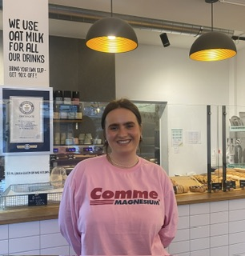

+++
title = "Die Bakery Bakery Reportage "
date = "2024-06-12"
draft = false
pinned = false
tags = ["Veganesessen", "Bäckere", "vegan", "Food", "Reportag", "BakeryBakery"]
image = "img_4394.png"
+++
Man steht hungrig in der Loraine und denkt direkt an die die Bakery Bakery, die erste vegane Bäckerei der Schweiz,sie ist mehr als nur ein Geschäft. Sie ist das Ergebnis einer langjährigen Leidenschaft für vegane Lebensmittel und einer Vision, die Lycra Stattmann und ihr Partner Kevin Schmid in die Realität umgesetzt haben. Lycra lebt seit siebzehn Jahren vegan und ihr Partner seit acht Jahren. Sie entscheiden sich, eine Lücke auf dem Markt zu füllen, indem sie leckere vegane Backwaren anbieten, die sehr gut bei ihren Kundinnen ankommen.

> "Es war anfangs einfach eine spontane Idee", erzählt Lycra Nachdem sie einen Schluck aus ihrer Kaffeetasse nimmt. "Aus einer Leidenschaft wurde dann ein Business." 

**Entstehung** 

Die Bakery Bakery entsteht 2019, als sie ein Pop-up in der Gelateria di Berna für drei Monate betreiben. Die positiven Rückmeldungen der Kunden ermutigen sie, ihren Traum weiterzuverfolgen und die erste rein vegane Bäckerei der Schweiz zu gründen. Das geschieht in Breitenrain, Bern. Mittlerweile hat die Bakery Bakery bereits fünf verschiedene Standorte in der Schweiz.

In der Bakery Bakery steht nicht nur die rein vegane Ernährung im Vordergrund, sondern auch das Bewusstsein für die Umwelt und ethische Entscheidungen. Die Bakery Bakery setzt einen hohen Wert darauf, dass ihre Produkte ethisch vertretbar sind. Zurzeit verwenden sie leider in ein paar Produkten Mischungen, welche Palmöl enthalten. Dies wollen sie verbessern. Zurzeit sind im Bakery Bakery Team 13 Personen, die nicht alle vegan sind. Denn Lycra erzählt, dass die Mitarbeiterinnen der Bakery Bakery nicht zwingend vegan sein müssen, aber es wird erwartet, dass sie sich mit dem Thema auseinandersetzen und dahinterstehen.

**Bei der Herstellung ihrer Produkte legt das Team Wert auf Geschmack und Qualität.**

>  "In erster Linie muss es einmal schmecken", betont Lycra freudig im Interview.

 Das Sortiment wird ständig an die Wünsche der Kunden angepasst, wobei Klassiker aus der Kindheit und natürlich die Bestseller drin bleiben. Die Gründerinnen Lycra und Kevin arbeiten eng mit einem Bäcker zusammen, um die Rezepturen zu verfeinern. Nach monatelangen Experimenten können selbst erfahrene Bäckerinnen den Unterschied zwischen veganen und tierischen Produkten nicht mehr feststellen. Das ist ein großer Schritt für die Bakery Bakery. 

**Weltrekord** 

Ein kalter Wintermorgen in Bern. In der Bakery Bakery herrscht geschäftiges Treiben und gespannte Vorfreude. Am 3. Februar 2024 soll hier das größte vegane Gebäck der Welt entstehen. Was als Spaß begann, wird nun Realität und bringt die kleine Bäckerei ins Rampenlicht. Ein Meilenstein für die Bakery Bakery steht bevor.  

Ein großer Schritt für die Bakery Bakery ist der Weltrekord, den sie am 3. Februar 2024 aufstellen für das größte vegane Gebäck. Die Idee, diesen Weltrekord aufzustellen, entsteht durch einen Spaß. Dann setzen sie diesen Spaß jedoch in die Realität um, und es klappt schlussendlich. Durch diese Aktion gelangt die Bakery Bakery in die Medien und in die Presse, was auch das Ziel ist. Diese Aktion dient jedoch nicht nur der Aufmerksamkeit, sondern auch als Statement für die Vielfalt und Kreativität der veganen Küche. 

**meinungen zu der Bakery Bakery** 

Die Bakery Bakery bekommt sehr viele positive Reaktionen und Rückmeldungen, jedoch nicht nur. Denn es gibt auch Kritik. Die vegane Bäckerei bekommt von einem rechtsorientierten Politiker Kritik, da er mit der Art, wie die Bakery Bakery ihre Backwaren benennt, ein Problem hat. Das Team gibt solchen Kritiken nicht besonders viel Aufmerksamkeit, denn sie konzentrieren sich auf die vielen positiven Rückmeldungen ihrer Kundinnen.

**Zukunft** 

Für die Zukunft plant die Bakery Bakery, ihr Sortiment zu erweitern, besonders im Bereich warmer Speisen und Schokolade. Ihre Bestseller, wie das "schocki Gipfeli", bleiben weiterhin beliebt bei ihren Kunden.

Abschließend lädt Lycra die Leser und Leserinnen ein, die Bakery Bakery zu besuchen und ihre veganen Köstlichkeiten zu probieren. "Sie sollen keine Angst haben, nur weil es vegan ist", betont sie. Die Bakery Bakery steht für Genuss, Vielfalt und eine nachhaltige Lebensweise - ein Ort, der zeigt, dass veganes Essen alles andere als langweilig ist.